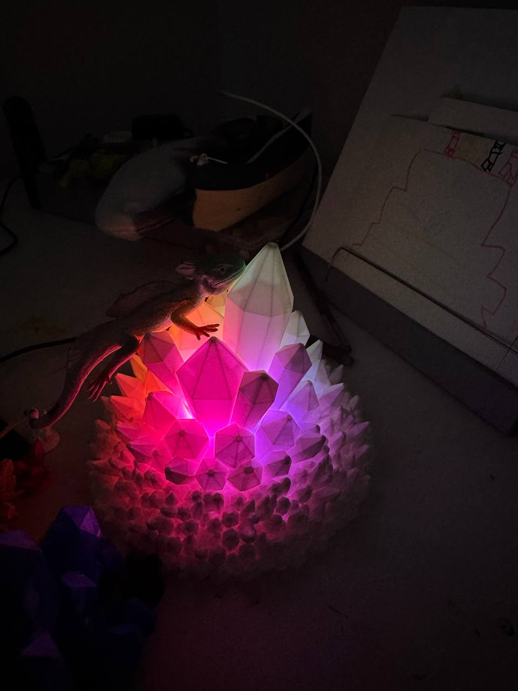

# Crystal Lamp

Прошивка кристальной лампы на обычном Arduino Nano ATmega328P с USB-C.
Адресная LED-лента 5 В работает через FastLED, режимы переключаются ударом
или встряхиванием датчика наклона KY-020. Wi-Fi и веб-интерфейса в этой версии
нет.

## Лампа в работе

| Фото | Анимация |
| --- | --- |
|  |  |

## 3D-модель

Готовая модель корпуса для печати: [скачать Crystal_Lamp.3mf](models/Crystal_Lamp.3mf).

Проект сохраняет удачные части архитектуры
[`pavel-gorlov/fireplace`](https://github.com/pavel-gorlov/fireplace):
PlatformIO, Arduino framework, FastLED, отдельные модули эффектов и сохранение
текущего режима после отключения питания.

## Железо

- Arduino Nano ATmega328P, 5 В / 16 МГц, USB-C;
- шариковый датчик наклона KY-020;
- адресная лента WS2811, 5 В;
- резистор 220-470 Ом, рекомендуется 330 Ом;
- электролитический конденсатор 470-1000 мкФ на 6.3 В или выше;
- USB-C источник 5 В.

## Подключение

Полная схема: [wiring.svg](wiring.svg). Пояснения и ограничения питания:
[docs/WIRING.md](docs/WIRING.md).

| Компонент | Контакт | Arduino Nano |
| --- | --- | --- |
| KY-020 | `S` | `D2` |
| KY-020 | `+` | `5V` |
| KY-020 | `-` | `GND` |
| LED-лента | `DIN` | `D6` через 330 Ом |
| LED-лента | `5V` | `5V` |
| LED-лента | `GND` | `GND` |

Ориентируйтесь именно на надписи `-`, `+`, `S` на модуле: порядок контактов
у похожих плат может отличаться.

## Управление

При движении шарика KY-020 сигнал `S` меняется между HIGH и LOW. Прошивка
принимает оба фронта через прерывание `D2`. Первый фронт сразу переключает
эффект, а остальные переходы того же потока движения игнорируются. Датчик
повторно готов к переключению после 500 мс полной тишины.

Двойного жеста и выключения лампы датчиком нет. Эффекты идут по кругу:
`Crystal Breath`, `Aurora`, `Prism`, `Glitter`, `Candle Core`, `Meteor`,
`Lightning`.

Выбранный режим записывается в EEPROM и восстанавливается после отключения
USB-C.

## Питание от одного USB-C

В прошивке установлен программный лимит FastLED `5 В / 400 мА`. Он нужен,
потому что питание ленты проходит через дорожки и защитные элементы Nano.
Лимит приблизительный и не заменяет правильно рассчитанное питание.

Адресные RGB-светодиоды на полном белом потребляют заметно больше, чем в
цветных эффектах. Для первого запуска:

- оставьте программный лимит `400 мА`;
- не используйте полный белый на максимальной яркости;
- поставьте конденсатор у входа ленты;
- если плата, кабель или разъем греются, сразу отключите питание.

Для более длинной ленты один USB-C можно сохранить, но 5 В лучше разветвить
до Nano: отдельными проводами подать питание параллельно на `5V` Nano и на
ленту, обязательно с общей землей.

## Сборка и прошивка

Установите VS Code с PlatformIO, подключите Nano по USB-C и выполните:

```bash
pio run
pio run -t upload
pio device monitor
```

Для этой платы проверен профиль нового загрузчика `nano_atmega328_new`, он
выбран по умолчанию:

```bash
pio run -e nano_atmega328_new -t upload
```

Профиль `nano_atmega328` оставлен как запасной для других Nano со старым
загрузчиком.

В Serial Monitor отображаются число LED, контакт датчика и выбранный режим.

## Настройка

Основные параметры находятся в [platformio.ini](platformio.ini):

```ini
build_flags =
    -DLED_PIN=6
    -DSHAKE_PIN=2
    -DSHAKE_DEBOUNCE_MS=500
    -DDEFAULT_NUM_LEDS=15
    -DMAX_LEDS=150
    -DPOWER_LIMIT_MA=400
```

Количество светодиодов задается через `DEFAULT_NUM_LEDS`; после изменения
увеличьте `SETTINGS_VERSION` в `src/config.h` или очистите EEPROM.

Структура проекта описана в [docs/STRUCTURE.md](docs/STRUCTURE.md).
